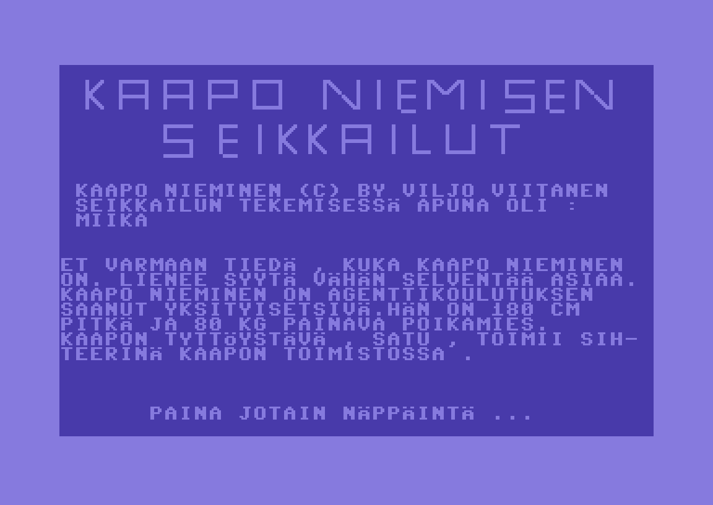

A Commodore 64 game created in 1987 by Viljo Viitanen, ported to Javascript in 2013.

The game is CC licensed. Other components have *free'ish* licenses:

C64 truetype font by Kreative Korporation - [license](font/FreeLicense.txt)

[Noribasic](http://www.kesiev.com/noribasic/) "do what you want but pray for our almighty god #c64"

